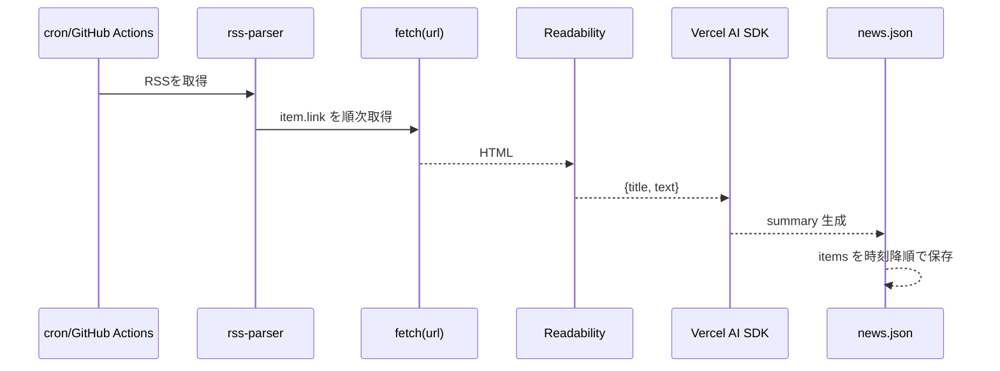

# 設計ドキュメント: RSS要約ニュース（Node 24 / Next.js 15 / React 19）

## 1. 概要

RSSフィードを複数登録し、**記事URLの本文を抽出**して**LLMで日本語要約**し、**カードUI**で「要約・URL・コピー」操作を提供するWebアプリ。**PWA対応**によりインストール可能・簡易オフライン閲覧を実現する。

---

## 2. 目的・目標

* 情報収集を高速化：RSS単位ではなく**本文ベース**の要約で精度を向上。
* 再利用容易なUI：**要約＋URL**をワンクリコピー。
* 軽量運用：**定期ジョブ**でまとめて要約を生成、フロントは静的配信主体。
* モジュール化：**LLMプロバイダ差し替え**可能（OpenAI/Geminiなど）。

### 成功基準（例）

* 記事到着から30分以内に要約反映。
* 要約の平均文字数 160–220字、固有名詞保持率 > 90%。
* PWA Lighthouse PWA カテゴリ 90点以上。

---

## 3. 想定ユーザー・ユースケース

* ニュース収集の効率化を求める個人。
* 社内共有のダイジェスト作成。

---

## 4. 要求仕様

### 機能要件

1. RSS登録：`feeds.json` にRSS URL列挙。
2. 定期取得：RSS取得→URL本文抽出→LLM要約→`data/news.json` 出力。
3. 表示：カードで「タイトル・要約・URL・ソース・日付」を表示。
4. コピー：カードから**要約＋URL**をクリップボードへコピー。
5. PWA：Web App Manifest＋Service Worker。オフライン時は直近データ表示。
6. 手動更新API（任意）：`POST /api/refresh` で更新ジョブ実行。

### 非機能要件

* パフォーマンス：初回描画 < 2s（典型回線時）。
* 可用性：定期ジョブ失敗時も既存 `news.json` で閲覧継続。
* セキュリティ：APIキーは `.env` で管理、SSRで秘匿。
* 運用容易性：GitHub Actions/cron で定期実行。

---

## 5. システム構成

* **フロントエンド**：Next.js 15 / React 19（App Router, ISR）。
* **要約ジョブ**：Node.js 24 スクリプト（`scripts/fetch.ts`）。
* **本文抽出**：JSDOM + @mozilla/readability。
* **LLM**：Vercel AI SDK（OpenAI/Gemini など）
* **データストア**：`data/news.json`（将来はSQLite/KVに拡張可）。
* **配信**：Vercel/Netlify/GitHub Pages 等（静的配信 + APIは任意）。

### 図: コンポーネント

```mermaid
flowchart LR
  subgraph Scheduler[定期ジョブ]
    A[RSS Parser] --> B[Fetch Article HTML]
    B --> C[Readability 抽出]
    C --> D[LLM 要約]
    D --> E[news.json 生成]
  end

  subgraph App[Next.js 15]
    E --> F[ISR page.tsx]
    F --> G[Card + CopyButton]
    H[Manifest / SW] -.PWA.-> App
  end
```

---

## 6. データモデル

`data/news.json`

```json
{
  "generatedAt": "2025-11-08T06:30:00.000Z",
  "items": [
    {
      "title": "...",
      "url": "https://...",
      "summary": "...",
      "source": "Feed Title",
      "publishedAt": "2025-11-08T05:10:00.000Z"
    }
  ]
}
```

将来拡張：`tags: string[]`, `read: boolean`, `thumbUrl: string` 等。

---

## 7. 処理フロー（要約ジョブ）



---

## 8. LLM要約仕様

* **入力**：`title`, `url`, `text(～8000字まで)`
* **プロンプト方針**：

  * 200字以内（`SUMMARY_MAX_CHARS` で調整）
  * 重要点を3項目前後に凝縮
  * 固有名詞は保持、誇張/推測は不可
* **モデル切替**：`.env` で `AI_PROVIDER=openai|google` を指定。
* **再試行**：429/5xx は指数バックオフ（3回）
* **フェイルセーフ**：本文抽出失敗時は `contentSnippet` を暫定要約に利用（要フラグ付け）。

---

## 9. PWA設計

* **Manifest**：`app/manifest.(ts|json)` を配置。`name/short_name/icons(192/512)/display:start_url` を定義。
* **Service Worker**：`public/sw.js`（最小）または Workbox で `Stale-While-Revalidate`（UI資産）、`NetworkFirst`（`news.json`）。
* **要件**：本番はHTTPS。LighthouseでPWA監査を通過。

---

## 10. エラー処理・リトライ

* フィード取得失敗：フィード単位でログ／継続処理。
* 記事取得失敗：URL単位でスキップし次へ。
* LLM失敗：再試行 → 失敗時はマーカー付きでスキップ。
* 出力整合性：生成直後に JSON スキーマ検証（任意）。

---

## 11. ログ・監視

* 収集フェーズ：処理件数、失敗件数、処理時間 p95 を標準出力（ActionsのArtifacts/ログで確認）。
* アプリ：簡易で良いが、Next.jsの`reportWebVitals`（任意）でLCP/CLS観測。

---

## 12. セキュリティ・プライバシー

* APIキーは `.env` 管理、サーバー側でのみ参照。
* リンク先の個人情報を意図的に抽出・保存しない。
* 送信データ最小化（タイトル＋本文テキストのみ）。

---

## 13. パフォーマンス最適化

* 文章抽出・要約は**並列**だが、ドメイン同時接続数を制限（礼節＋ブロック回避）。
* `revalidate` によりフロントは60秒キャッシュ。
* `news.json` は最大200件まで表示、ページングは将来対応。

---

## 14. デプロイ/運用

* **定期実行**：

  * cron 例：`*/15 * * * * pnpm fetch`
  * GitHub Actions：`actions/setup-node@v4` で Node 24、`pnpm fetch` 実行→`data/news.json` をコミット
* **ホスティング**：Vercel/Netlify/GitHub Pages（静的）＋任意で `POST /api/refresh` を配置。

---

## 15. テスト計画

* 単体：

  * 抽出：Readability出力が非空であること
  * 要約：最大文字数、禁止語（任意）
* 結合：RSS→要約→保存のE2E（モックLLM）
* PWA：Lighthouse PWA スコア、オフライン時のフォールバック確認。

---

## 16. リスクと対応

* **記事本文が取得できない**：動的レンダリングサイトはReadability不能→サーバー側レンダリング（Playwright/puppeteer）を将来オプション化。
* **APIコスト**：要約コスト上振れ→キャッシュ/重複排除/重要度スコアによる間引き。
* **レート制限**：指数バックオフ＋キューング。

---

## 17. 将来拡張

* SQLite/Drizzle化、タグ・既読管理、検索（全文/ベクトル）、サムネイル抽出（OGP）。
* Server Actionsでの手動再生成。
* WebPush/通知（許諾ベース）。

---

## 付録A. 主要ファイル

* `scripts/fetch.ts`：RSS→HTML→Readability→LLM→`news.json`
* `app/page.tsx`：表示（ISR）
* `app/components/*`：`Card` と `CopyButton`
* `app/manifest.*`：PWAマニフェスト
* `public/sw.js`：Service Worker（最小）

## 付録B. 主要環境変数

```
AI_PROVIDER=openai|google
OPENAI_API_KEY=...
GOOGLE_GENERATIVE_AI_API_KEY=...
SUMMARY_MAX_CHARS=220
FETCH_TIMEOUT_MS=15000
```

## 付録C. コマンド

```
pnpm fetch   # 定期要約生成ジョブ
pnpm dev     # ローカル起動
pnpm build && pnpm start  # 本番
```
